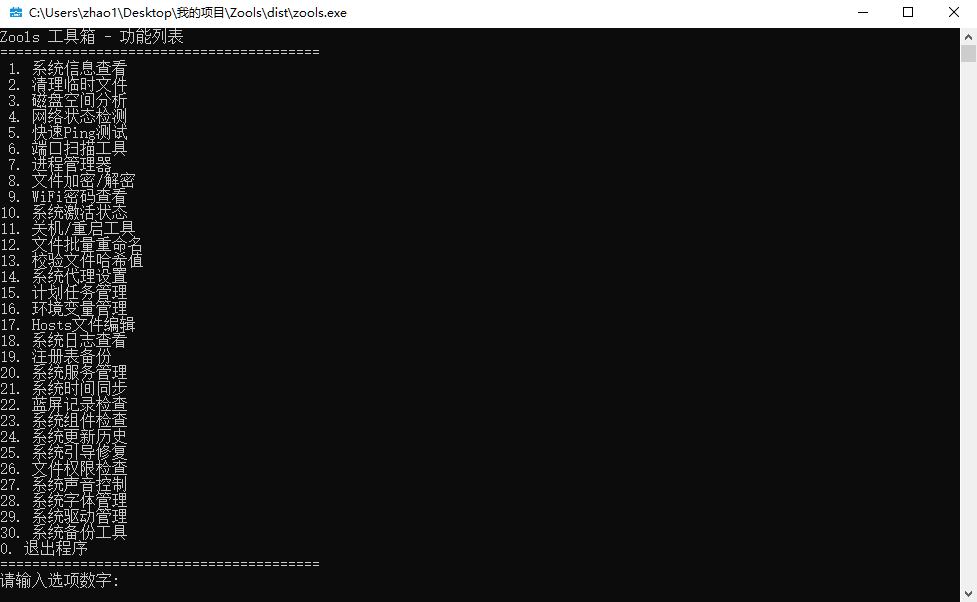

# 🧰 zools - 基于Python开发的轻量化Windows工具箱

## 📄 开源协议
[Apache License 2.0](LICENSE) - 您需遵守以下条款：
1. 使用本软件必须附带原始许可证及版权声明
2. 修改版本必须明确标识变更记录
3. 如包含NOTICE文件需保留版权声明

一款基于Python开发的轻量化Windows系统工具集合，整合30项常用功能，覆盖系统维护、网络工具、文件管理、系统配置四大核心场景。

## 🚀 核心功能

### 🔧 系统维护
1. 全面系统信息查看（硬件配置/软件环境）
2. 智能清理临时文件（浏览器缓存/系统日志）
3. 磁盘空间可视化分析
4. 进程实时监控与强制终止
5. 系统服务管理（启动/停止/配置）
6. 注册表快速备份与恢复
7. 开机启动项优化管理
8. 系统激活状态检测
9. 系统时间自动同步
10. 蓝屏日志分析器
11. 系统更新历史追溯
12. 引导修复工具

### 🌐 网络工具
13. 网络状态实时监控
14. 多节点Ping测试
15. 端口扫描器（TCP/UDP）
16. 系统代理快速配置
17. WiFi密码提取器

### 📁 文件管理
18. 文件批量重命名（支持正则表达式）
19. AES-256文件加密/解密
20. 文件哈希校验（MD5/SHA1/SHA256）
21. 目录权限检查
22. 系统Hosts文件编辑器
23. 字体包管理器
24. 驱动版本管理

### ⚙️ 系统配置
25. 环境变量编辑器
26. 计划任务管理器
27. 系统声音控制器（音量混音器）
28. 系统组件检查器
29. 系统备份工具（增量/全量）
30. 快捷关机/重启工具

## 📦 使用

### 💻环境需求
- Windows XP 系统及以上

### ⏬快速使用
1. 从[发行版](https://github.com/zhaotxpro/zools/releases/tag/alpha)中下载需要的版本。
2. 右键zools.exe使用管理员打开。

## 🛠️ 技术架构
- 核心框架：Python 3.10 控制台应用程序框架 + 模块化功能架构
- 系统接口：Win32API调用(ctypes) / Windows注册表操作(winreg) / WMIC系统命令
- 关键依赖：win32api(pywin32) / psutil(进程管理) / cryptography(加密模块)

## 🤝 参与开发
欢迎提交PR或Issue，开发准则：
- 新功能请创建feature分支
- 使用Google-style Python注释规范
- 重要功能需包含单元测试
- 遵循PEP8代码格式规范
